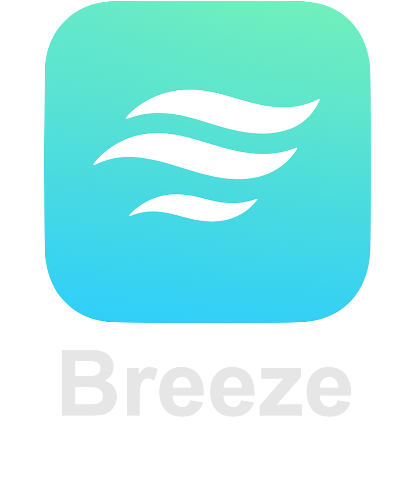

# Breeze - Real-time Anonymous Chat Application

<div align="center">
  
</div>

Breeze is a real-time anonymous chat application that allows users to connect with random people for meaningful conversations. The application features a clean, modern interface and incorporates World ID verification for enhanced security and authenticity.

## Features

- 🎯 **Random Matching**: Connect with random people for meaningful conversations
- ⏱️ **Time-limited Chats**: 5-minute chat sessions to encourage genuine interactions
- 🔒 **World ID Verification**: Secure identity verification using World ID
- 💬 **Real-time Chat**: Instant messaging with typing indicators
- 🎨 **Modern UI**: Clean and intuitive user interface with Breeze theme
- 🔄 **World ID Exchange**: Exchange World IDs with your match after successful connection

## Tech Stack

- **Frontend**: Next.js, TypeScript, Tailwind CSS
- **Real-time Communication**: Socket.io
- **Authentication**: World ID, SIWE (Sign In With Ethereum)
- **Styling**: Tailwind CSS, Shadcn UI components
- **Package Manager**: pnpm

## Prerequisites

- Node.js (v18 or later)
- pnpm (v8 or later)
- World App installed on your device
- World ID developer account

## Getting Started

1. **Clone the repository**
   ```bash
   git clone https://github.com/yeeetai/breeze.git
   cd breeze
   ```

2. **Install dependencies**
   ```bash
   pnpm install
   ```

3. **Set up environment variables**
   Create a `.env` file in the root directory with the following variables:
   ```
   APP_ID=your_mini_app_id
   DEV_PORTAL_API_KEY=your_dev_portal_api_key
   WLD_CLIENT_ID=your_wld_client_id
   WLD_CLIENT_SECRET=your_wld_client_secret
   ```

4. **Start the development server**
   ```bash
   pnpm dev
   ```

5. **Open your browser**
   Visit `http://localhost:3000` to see the application in action.

## Usage Flow

1. **Connect Wallet**
   - Click "Connect Wallet" to connect your Ethereum wallet
   - Sign the message to verify wallet ownership

2. **Verify World ID**
   - Click "Verify World ID" to verify your identity
   - Follow the World App prompts to complete verification

3. **Start Chatting**
   - Click "Start Chatting" to begin matching
   - Get matched with a random person
   - Chat for 5 minutes
   - Option to add as friend when time's up

## Contributing

Contributions are welcome! Please feel free to submit a Pull Request.

## License

This project is licensed under the MIT License - see the [LICENSE](LICENSE) file for details.

## Acknowledgments

- World ID for identity verification
- Socket.io for real-time communication
- Shadcn UI for beautiful components
